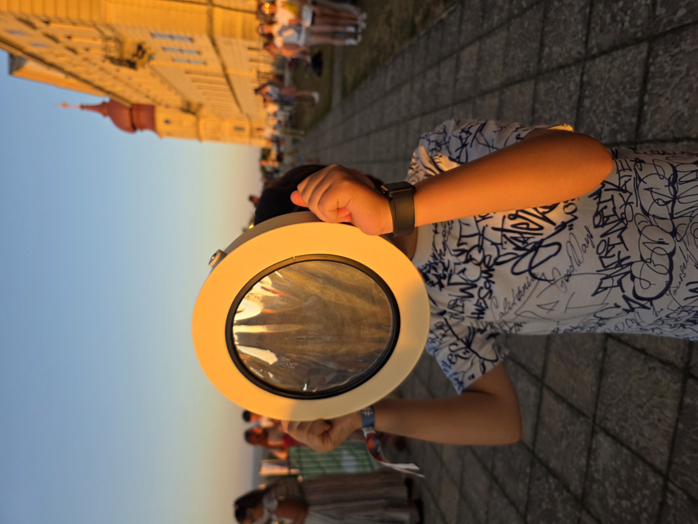

# Bildtest – Markdown & Astro

Heute teste ich, wie Bilder direkt aus einem Markdown-Beitrag auf MMKF-RS eingebunden werden.

## Das Testbild

Das Bild soll direkt zwischen dem Text erscheinen:

Und hier geht der Text danach ganz normal weiter.

## Was wir gerade testen

- Markdown-Blog
- lokale Bilder
- Astro-Bildoptimierung
- Darstellung im Beitrag

Wenn das funktioniert, habe ich die Grundlage für richtige Fotobeiträge.

---

*MMKF-RS – 17.08.2026*