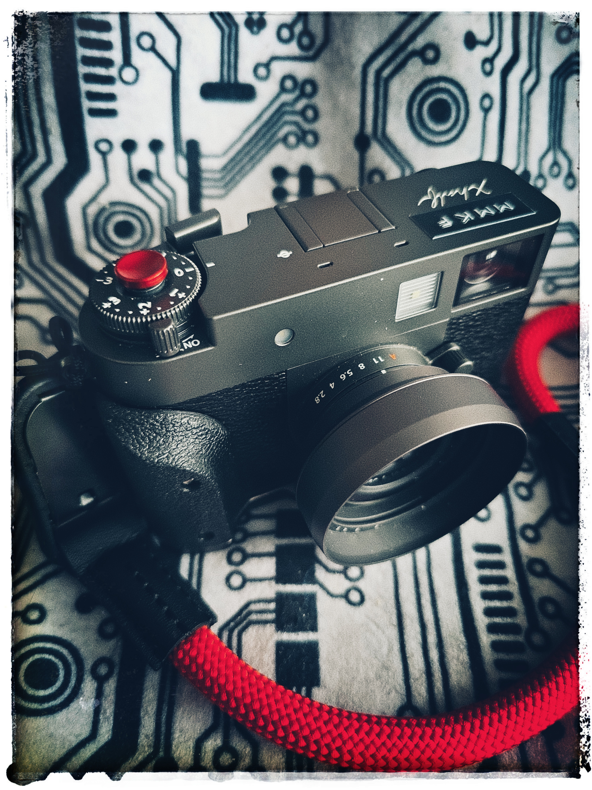

So, mittlerweile besitze ich die **Fujifilm X-Half** seit 3 Monaten.

Specs gibt's keine, da wir alle wissen: Die Kamera ist technisch Mist.

Aber Fujifilm hat für vielleicht sehr wenige etwas Besonderes gemacht, und das ist für mich der Punkt: Das Teil macht Freude beim Fotografieren und dann auch beim Anschauen der fertigen Bilder.

Echt, bei der Kamera stimmt technisch nix.

Der Sucher ist Mist, das Display, der Autofokus, das Gehäuse ist Plastik – aber hier Punkt für Fujifilm: Es fühlt sich trotzdem echt gut an, wie eine wertige Mickey-Maus-Kamera.

Die Bildqualität ist mau ... das Bildrauschen, hmmmmm.

Aber jetzt komm ich mal genau dazu.

**Ja, das will ich.**

Bildrauschen, schlechte, rohe, einfache Bilder, die ziemlich viel Charme haben und digital gesehen sehr nahe an analog kommen.

Und des Nachts erst – das Teil hat Charme und ich mag ihn.

Ich denke nicht viel drüber nach, sondern mach Bilder.

Und zum Nachdenken, wie man Bilder macht, hab ich genug andere Kameras.

Noch mehr erinnert sie mich an meine **Ricoh GR**. Die ist ja eigentlich relativ ähnlich – technisch kann sie natürlich viel mehr, wird dadurch auch teurer und besser verkauft, aber am Ende nutzt man vieles davon trotzdem nicht :-)

So, in der Galerie gibt's Bilder der letzten drei Monate zum Anschauen oder auch nicht.

Was weiß ich, wer sich diese Seite jemals anschaut :-)

Ach ja, und der Name **FFX** hört sich doch etwas nach *Final Fantasy X* an, was mir auch irgendwie gefällt.

(Lieber wäre mir halt 7.)